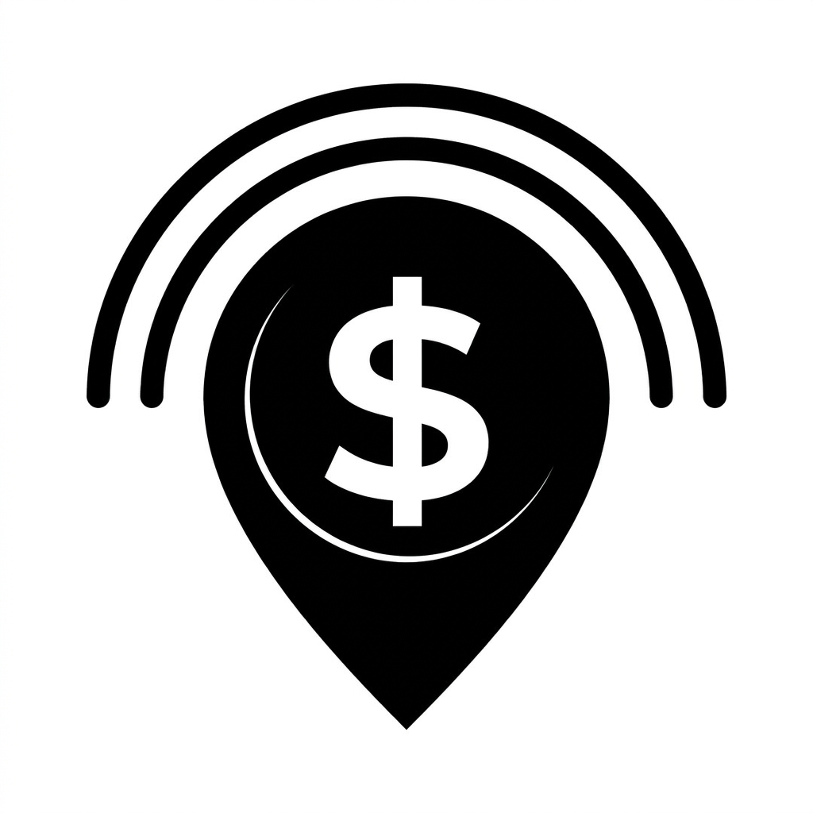

# README.md

Drop this at `C:\Users\Shema\Desktop\money-radar\README.md`. It references your existing logo at `assets/logo.png`.

---

```md
<p align="center">
  
</p>

<h1 align="center">Money Radar</h1>

<p align="center">
  Read how a currency or crypto pair is behaving — not just what it costs.
</p>

---

## What it does

Money Radar fetches one long daily series per pair, then reads it from three angles:

- **Straight-line view** — fits a trend line, builds a tolerance band around it, and shows whether today sits inside or outside that band.
- **Behaviour reading** — detects streaks, pace, and magnitude (climbing, surging, slipping, sliding, stalling, steady, reversing).
- **Past cases** — finds earlier days that looked like today and counts how often the move continued, against the baseline.

It also converts between the pair's two currencies using the latest real rate, with a one-tap swap.

Every pair is fetched once and reused for the price, sparkline, 1M / 3M / 1Y views, behaviour read, and statistics. All analysis runs in memory on the device.

## How to use it

- **Home** shows your watchlist with the latest rate, monthly change, sparkline, and a behaviour chip.
- **Tap a pair** to open the full reading: converter, chart, tolerance slider, verdict, behaviour, past cases.
- **Swap** in the Exchange card flips base and quote.
- **Docs tab** explains each section in plain language.
- **Theme toggle** on Home — System, Light, or Dark. Persists across restarts.

## Stack

- **Expo SDK 57** with React Native and web
- **Expo Router** (tabs + stack)
- **TanStack Query** for data fetching and caching
- **Zod** for API response validation
- **react-native-svg** for charts (no chart library)
- **react-native-reanimated** for enter motion
- **AsyncStorage** for watchlist and theme persistence
- **NativeWind (Tailwind)** for layout classes; colours come from a themed palette

## Data sources

- **Fiat** — [Frankfurter](https://frankfurter.dev). Rwandan franc pairs use the BNR provider, which publishes monthly rates; those pairs get the straight-line view only.
- **Crypto** — [CoinGecko](https://www.coingecko.com). A free demo key is optional and only raises the rate limit.

Granularity is detected from the dates, so monthly and daily series are handled by the same code path.

## Project structure
```

app/ Expo Router routes
(tabs)/ Home + Docs
pair/[id].tsx Pair detail
add-pair.tsx Modal
src/
screens/ Page assemblies
layouts/ Shared screen frame
components/ui/ Reusable primitives
components/sections/<screen>/ Section components
content/ All copy (strings, docs, behaviour text)
data/ Hard-coded pairs, timeframes, defaults
types/ Domain interfaces
constants/ Theme, layout, motion
context/ providers/ React context and providers
hooks/ Data + derived state hooks
lib/
api/ Provider clients
mappers/ Provider → domain
analysis/ Pure functions (behaviour, pattern, linear fit)
testing/ Fixtures and smoke tests

````

Every section follows one chain: **interface** (`types/sections.ts`) → **data form** (hard-coded in `data/`, or computed in a hook with `useMemo`) → **section component** → **screen assembly**.

## Getting started

```bash
git clone <this-repo> money-radar
cd money-radar
npm install
npx expo start --web
````

On a phone, scan the QR code with Expo Go. No native build is required for the MVP.

### Optional: CoinGecko demo key

Create `.env` at the project root:

```
EXPO_PUBLIC_COINGECKO_KEY=your_key_here
```

Restart Metro with `-c` after adding it. The key only raises the rate limit — the app works without it.

## Tests

```bash
npm test
```

Covers the pure analysis layer: behaviour detection, pattern statistics, linear fit, and series mapping. These functions have no React or network dependencies, so they're easy to test and safe to trust.

## Honest notes

- Behaviour and past-case statistics only run on daily data. Monthly-published pairs (RWF) show the straight-line view instead.
- Past cases are counted honestly: each day's state is computed using only data up to that day, so nothing looks better than it actually was.
- Patterns can stop at any time. This is not financial advice.

## Licence

MIT

```

---

## Notes on the README

- **Logo** — `` renders on GitHub. If the path is wrong, GitHub shows a broken image; keep the file at `assets/logo.png` exactly.
- **Length** — about one screen of scrolling. Long enough to explain what you built; short enough to read before the coffee gets cold.
- **Tone** — first-person neutral ("what it does"), no marketing voice. That reads as confidence, not hype.
- **The "Honest notes" section** is the one that lands with a reviewer. It says you understand the limitations of your own tool.
- **No emoji headers**, no badges, no GIFs. Clean, senior.

If you want it even shorter, cut the **Project structure** block — but I'd keep it, because it's the part that proves you thought about architecture and not just features.
```
